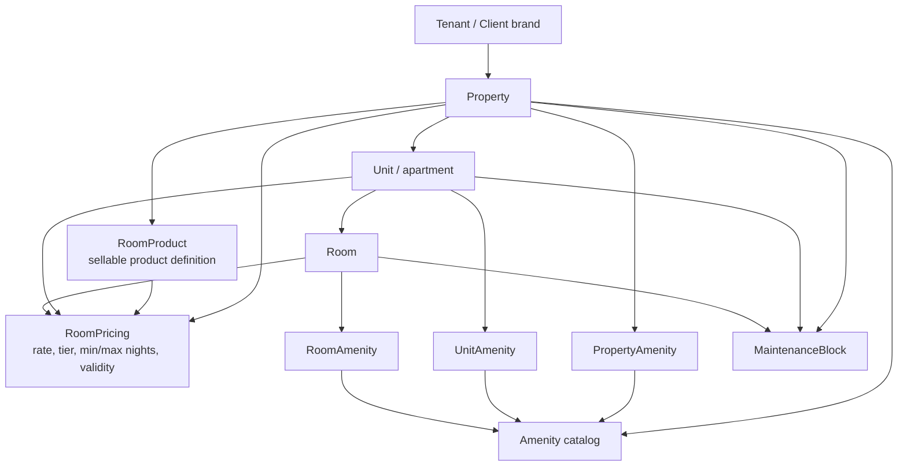
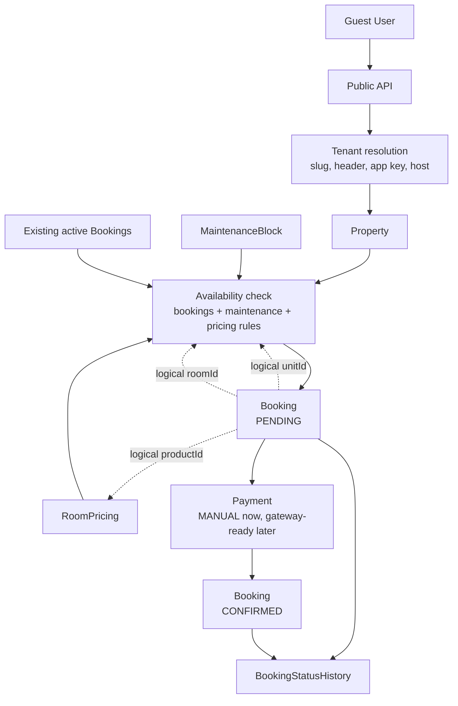
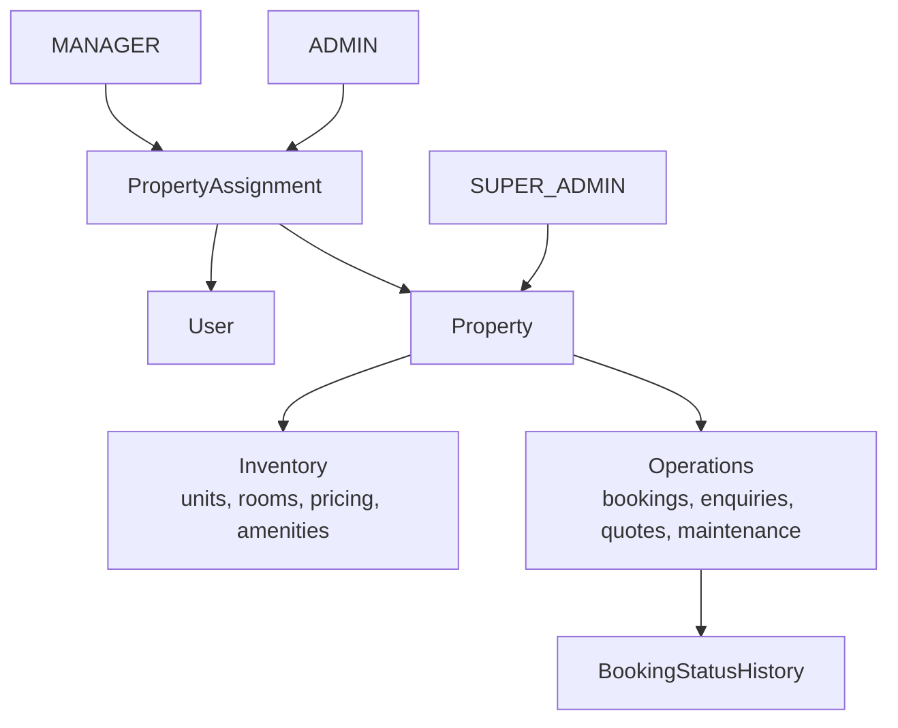
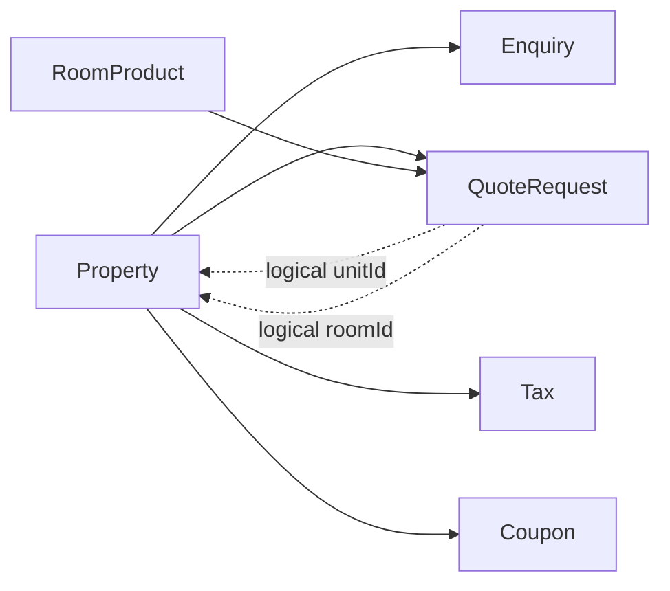

# Database Diagram

This document maps the current Prisma/MySQL schema in `backend/prisma/schema.prisma`.

Legend:

- Solid ERD edges are Prisma-enforced relations.
- Dotted flowchart edges are logical references or workflow dependencies.
- `Booking.roomId`, `Booking.unitId`, `Booking.productId`, `QuoteRequest.roomId`, and `QuoteRequest.unitId` are stored identifiers, but they are not Prisma relations in the current schema.

## Full Entity Relationship Diagram

```mermaid
erDiagram
  USER {
    String id PK
    String fullName
    String email UK
    String createdByUserId FK
    UserRole role
    Boolean isActive
    DateTime createdAt
    DateTime updatedAt
  }

  SESSION {
    String id PK
    String userId FK
    String refreshToken UK
    DateTime expiresAt
    DateTime createdAt
  }

  PASSWORD_RESET_TOKEN {
    String id PK
    String userId FK
    String tokenHash
    DateTime expiresAt
    DateTime createdAt
  }

  TENANT {
    String id PK
    String name
    String slug UK
    String primaryDomain UK
    TenantStatus status
    String brandName
    String defaultCurrency
    String timezone
  }

  PROPERTY {
    String id PK
    String tenantId FK
    String createdByUserId FK
    String name
    String city
    String state
    PropertyStatus status
    Boolean isActive
  }

  UNIT {
    String id PK
    String propertyId FK
    String unitNumber
    Int floor
    UnitStatus status
    Boolean isActive
  }

  ROOM {
    String id PK
    String unitId FK
    String name
    String number
    Float rent
    Int maxOccupancy
    RoomStatus status
    Boolean isActive
  }

  ROOM_PRODUCT {
    String id PK
    String propertyId FK
    String name
    Int occupancy
    Boolean hasAC
    RoomProductCategory category
  }

  ROOM_PRICING {
    String id PK
    String propertyId FK
    String roomId FK
    String unitId FK
    String productId FK
    RateType rateType
    PricingTier pricingTier
    Int minNights
    Int maxNights
    Decimal price
    DateTime validFrom
    DateTime validTo
  }

  QUOTE_REQUEST {
    String id PK
    String propertyId FK
    String userId FK
    String productId FK
    BookingTargetType targetType
    String unitId
    String roomId
    LeadStatus status
    DateTime checkIn
    DateTime checkOut
  }

  BOOKING {
    String id PK
    String bookingRef UK
    String propertyId FK
    String userId FK
    String productId
    BookingTargetType targetType
    String unitId
    String roomId
    String guestNameSnapshot
    String guestEmailSnapshot
    String targetLabel
    String productName
    Decimal pricePerNight
    BookingStatus status
    Decimal totalAmount
    DateTime checkIn
    DateTime checkOut
  }

  BOOKING_STATUS_HISTORY {
    String id PK
    String bookingId FK
    BookingStatus fromStatus
    BookingStatus toStatus
    String actorUserId FK
    String note
    DateTime createdAt
  }

  PAYMENT {
    String id PK
    String bookingId FK
    String propertyId FK
    String userId FK
    PaymentProvider provider
    PaymentStatus status
    Decimal amount
    String currency
    String idempotencyKey UK
    String providerPaymentId
    DateTime paidAt
  }

  AMENITY {
    String id PK
    String propertyId FK
    String name
    String icon
    Boolean isActive
  }

  PROPERTY_AMENITY {
    String propertyId PK,FK
    String amenityId PK,FK
  }

  UNIT_AMENITY {
    String unitId PK,FK
    String amenityId PK,FK
  }

  ROOM_AMENITY {
    String roomId PK,FK
    String amenityId PK,FK
  }

  ENQUIRY {
    String id PK
    String propertyId FK
    String name
    String email
    String contactNumber
    LeadStatus status
  }

  PROPERTY_ASSIGNMENT {
    String id PK
    String propertyId FK
    String userId FK
    PropertyAssignmentRole role
    String assignedByUserId FK
  }

  MAINTENANCE_BLOCK {
    String id PK
    String propertyId FK
    String unitId FK
    String roomId FK
    MaintenanceTargetType targetType
    DateTime startDate
    DateTime endDate
    String createdByUserId FK
  }

  TAX {
    String id PK
    String propertyId FK
    String name
    Decimal rate
    TaxType taxType
    Boolean isActive
  }

  COUPON {
    String id PK
    String propertyId FK
    String code
    DiscountType discountType
    Decimal discountValue
    Int maxUses
    Int usedCount
    DateTime validFrom
    DateTime validTo
    Boolean isActive
  }

  USER |o--o{ USER : creates
  USER ||--o{ SESSION : owns
  USER ||--o{ PASSWORD_RESET_TOKEN : requests
  USER ||--o{ PROPERTY : creates
  USER ||--o{ BOOKING : makes
  USER ||--o{ PAYMENT : pays
  USER |o--o{ QUOTE_REQUEST : optional_requester
  USER |o--o{ BOOKING_STATUS_HISTORY : optional_actor
  USER ||--o{ PROPERTY_ASSIGNMENT : assigned_user
  USER ||--o{ PROPERTY_ASSIGNMENT : assigned_by
  USER ||--o{ MAINTENANCE_BLOCK : creates

  TENANT ||--o{ PROPERTY : owns

  PROPERTY ||--o{ UNIT : contains
  UNIT ||--o{ ROOM : contains

  PROPERTY ||--o{ ROOM_PRODUCT : defines
  PROPERTY ||--o{ ROOM_PRICING : scopes
  ROOM_PRODUCT ||--o{ ROOM_PRICING : priced_by
  UNIT |o--o{ ROOM_PRICING : optional_unit_rate
  ROOM |o--o{ ROOM_PRICING : optional_room_rate

  PROPERTY ||--o{ QUOTE_REQUEST : receives
  ROOM_PRODUCT |o--o{ QUOTE_REQUEST : optional_quoted_product

  PROPERTY ||--o{ BOOKING : receives
  BOOKING ||--o{ PAYMENT : has
  BOOKING ||--o{ BOOKING_STATUS_HISTORY : audits
  PROPERTY ||--o{ PAYMENT : scopes

  PROPERTY ||--o{ AMENITY : owns
  PROPERTY ||--o{ PROPERTY_AMENITY : has
  AMENITY ||--o{ PROPERTY_AMENITY : links
  UNIT ||--o{ UNIT_AMENITY : has
  AMENITY ||--o{ UNIT_AMENITY : links
  ROOM ||--o{ ROOM_AMENITY : has
  AMENITY ||--o{ ROOM_AMENITY : links

  PROPERTY ||--o{ ENQUIRY : receives
  PROPERTY ||--o{ PROPERTY_ASSIGNMENT : grants_access

  PROPERTY ||--o{ MAINTENANCE_BLOCK : blocks
  UNIT |o--o{ MAINTENANCE_BLOCK : optional_unit_block
  ROOM |o--o{ MAINTENANCE_BLOCK : optional_room_block

  PROPERTY ||--o{ TAX : configures
  PROPERTY ||--o{ COUPON : offers
```

## Tenant And Inventory Boundary

How it works:

1. `Tenant` owns one or more `Property` records.
2. `Property` is the main operational boundary for dashboard scoping, public listings, bookings, pricing, enquiries, and payments.
3. Inventory is hierarchical: property contains units, units contain rooms.
4. Sellable pricing is configured through `RoomProduct` and `RoomPricing`; pricing may apply at property/product level and optionally narrow to a unit or room.
5. Maintenance can block a whole property, a unit, or a room depending on `targetType`.

## Booking And Payment Workflow

Important behavior:

1. Public booking creation should resolve tenant first, then scope availability to tenant-owned properties.
2. Availability depends on active booking overlap, maintenance windows, pricing validity, and min/max night rules.
3. `Booking` stores guest snapshots and target/product labels so historical bookings remain readable even if inventory names change later.
4. `Payment.idempotencyKey` prevents duplicate payment confirmations.
5. Status changes write `BookingStatusHistory`, optionally linked to the acting user.

## Dashboard Operations And Access Control

Access model:

1. `SUPER_ADMIN` can operate globally.
2. `ADMIN` and `MANAGER` access is property-scoped through `PropertyAssignment`.
3. Managers should stay focused on operations workflows; inventory/pricing/admin surfaces remain guarded by backend RBAC.

## Lead And Commercial Configuration

Notes:

1. `Enquiry` is a general lead tied to a property.
2. `QuoteRequest` is a stay/product lead tied to a property and optionally a user/product.
3. `Tax` and `Coupon` are property-level commercial configuration tables.

## Relationship Notes

- `Property` is the busiest aggregate root: it scopes inventory, pricing, bookings, payments, leads, assignments, maintenance, taxes, and coupons.
- `Tenant` currently scopes properties and public brand configuration; users are not directly tenant-owned in the schema.
- `RoomPricing.roomId` and `RoomPricing.unitId` are optional, so pricing can be broad at product/property level or narrow to a specific unit/room.
- `Booking` intentionally stores snapshots such as guest details, `targetLabel`, `productName`, and `pricePerNight`.
- Booking target ids are useful for availability queries, but the schema does not enforce FK constraints from `Booking` to `Room`, `Unit`, or `RoomProduct`.
- `Payment` is already provider-aware for future Razorpay/Stripe work, while manual payment remains the current MVP path.
